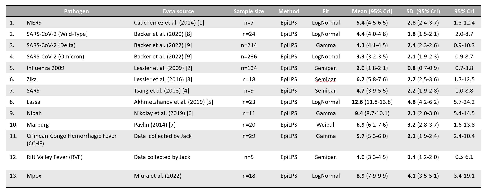

Estimation of incubation distributions with EpiLPS for different
pathogens
================
Oswaldo Gressani
2025-03-15

## Repository description

Contains R scripts for reproducing incubation estimation results
obtained with the [EpiLPS](https://epilps.com/) package in the MedRxiv
preprint: “The epidemiology of pathogens with pandemic potential: A
review of key parameters and clustering analysis” by Ward, J., Gressani,
O., Kim, S., Hens, N., Edmunds, W.J. (2025).
<https://doi.org/10.1101/2025.03.13.25323659>. Reference numbers for
data sources in the above table correspond to the reference numbers in
our article.

### Acknowledgments

This work was supported by the ESCAPE project (101095619), co-funded by
the European Union. Views and opinions expressed are however those of
the author(s) only and do not necessarily reflect those of the European
Union or European Health and Digital Executive Agency (HADEA). Neither
the European Union nor the granting authority can be held responsible
for them. This work was co-funded by UK Research and Innovation (UKRI)
under the UK governments Horizon Europe funding guarantee \[grant number
10051037\].
